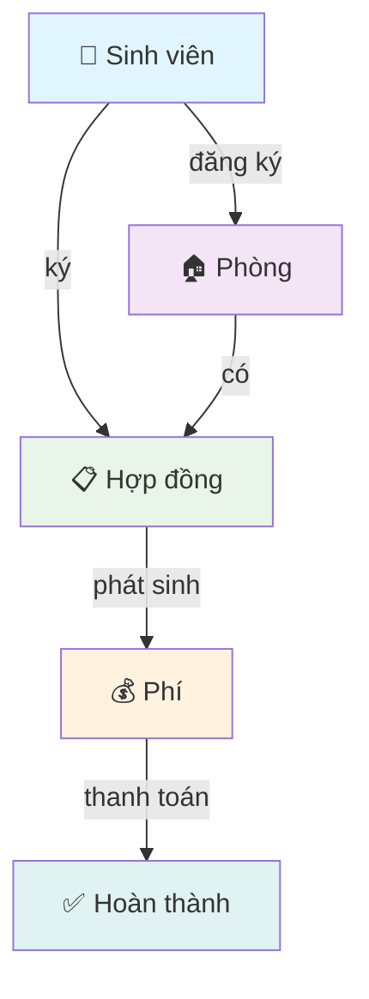
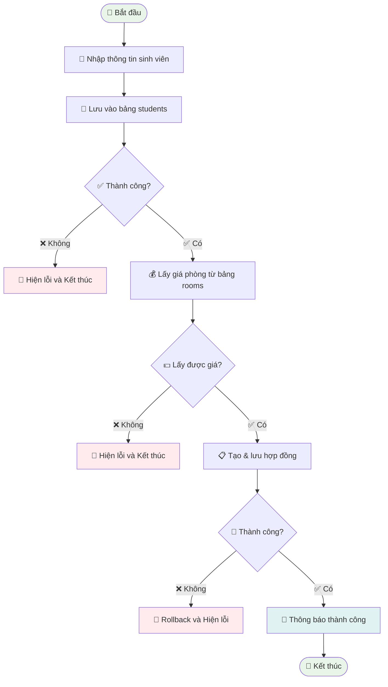

# 🏠 OOP_N01_Term3_2025_K17_Group9

<div align="center">

# 🎯 Dormitory Management System
### *OOP Term Project - Group 9*

[](https://www.java.com/)
[](https://spring.io/projects/spring-boot)
[](https://www.mysql.com/)
[](https://github.com/)

*Một ứng dụng quản lý ký túc xá hiện đại, được xây dựng với Java Spring Boot*

---

### 👥 **Team Members**

| 🧑‍💻 Member | 🔗 GitHub |
|:-----------|:----------|
| **Nguyễn Tùng Bách** | [@BachNguyenn](https://github.com/BachNguyenn) |
| **Nguyễn Thành Dương** | [@ThanhhDuongg](https://github.com/ThanhhDuongg) |
| **Lê Duy Thái Dương** | [@Nora-LeDuong](https://github.com/Nora-LeDuong) |
| **Nguyễn Lệ Thu** | [@nglthu](https://github.com/nglthu) |

</div>

---

## 🌟 **Giới thiệu dự án**

> **Dormitory Management** là một ứng dụng quản lý ký túc xá được phát triển bằng **Java Spring Boot**, cung cấp giải pháp toàn diện để quản lý thông tin sinh viên, phòng ở, hợp đồng và phí dịch vụ trong ký túc xá.

### ✨ **Điểm nổi bật**
- 🔄 **Full CRUD Operations** - Thao tác dữ liệu hoàn chỉnh
- 🌐 **Modern Web Interface** - Giao diện web thân thiện và hiện đại
- ☁️ **Cloud Database** - Lưu trữ dữ liệu trên Cloud MySQL
- 🧪 **Comprehensive Testing** - Kiểm thử tự động đầy đủ
- 📊 **Data Visualization** - Thống kê và báo cáo trực quan

---

## 🚀 **Tính năng chính**

<div align="center">

| 🎓 **Quản lý Sinh viên** | 🏠 **Quản lý Phòng** |
|:------------------------:|:-------------------:|
| • Thêm/Sửa/Xóa sinh viên | • Thêm/Sửa/Xóa phòng |
| • Tìm kiếm và lọc | • Xem danh sách sinh viên |
| • Hiển thị chi tiết | • Quản lý loại phòng |
| • Phân loại theo phòng | • Theo dõi số lượng giường |

| 📋 **Quản lý Hợp đồng** | 💰 **Quản lý Phí** |
|:-----------------------:|:------------------:|
| • Lập hợp đồng ở | • Quản lý nhiều loại phí |
| • Cập nhật thời hạn | • Theo dõi thanh toán |
| • Quản lý trạng thái | • Báo cáo tài chính |
| • Liên kết sinh viên-phòng | • Thống kê chi phí |

</div>

---

## 🛠️ **Công nghệ sử dụng**

<div align="center">

### **Backend Technologies**


### **Frontend Technologies**


### **Database & Testing**


</div>

---

## 🏗️ **Kiến trúc dự án**

```
🎯 Áp dụng mô hình MVC (Model - View - Controller)
```

<div align="center">

### **🔄 Cấu trúc MVC**

| **Model** 📊 | **View** 🖼️ | **Controller** 🎮 |
|:------------:|:----------:|:----------------:|
| Student | Web Interface | StudentController |
| Room | Thymeleaf Templates | RoomController |
| Contract | Bootstrap UI | ContractController |
| Fee | Responsive Design | FeeController |

</div>

### 📁 **Cấu trúc thư mục**

```plaintext
🗂️ OOP_N01_Term3_2025_K17_Group9/
├── 📁 src/
│   ├── 📁 main/
│   │   ├── 📁 java/com/example/dorm_web/
│   │   │   ├── 🎮 controller/          # Controllers
│   │   │   ├── ⚠️ exception/           # Exception Handlers
│   │   │   ├── 📊 model/               # Data Models
│   │   │   ├── 🗄️ repository/          # Data Access Layer
│   │   │   ├── ⚙️ service/             # Business Logic
│   │   │   └── 🚀 DormWebApplication.java
│   │   └── 📁 resources/
│   │       ├── 🎨 static/              # CSS, JS, Images
│   │       └── 🖼️ templates/           # HTML Templates
├── 🧪 test/                           # Unit Tests
├── 📝 README.md
└── ⚙️ pom.xml                          # Maven Configuration
```

---

## 🎯 **Đối tượng và chức năng**

<div align="center">

### **🔍 Chi tiết các đối tượng chính**

</div>

### 🎓 **Sinh viên (Student)**
- **📋 Thông tin cá nhân:** Họ tên, ngày sinh, giới tính, quê quán
- **📞 Thông tin liên hệ:** Email, số điện thoại, địa chỉ
- **🏠 Thông tin phòng ở:** Phòng hiện tại, lịch sử phòng
- **📋 Thông tin hợp đồng:** Hợp đồng hiện tại và lịch sử

**🔧 CRUD Operations:**
- ✅ Thêm sinh viên mới
- 📝 Cập nhật thông tin
- 🗑️ Xóa sinh viên
- 🔍 Tìm kiếm và lọc
- 👁️ Xem chi tiết

### 🏠 **Phòng (Room)**
- **🏷️ Thông tin phòng:** Số phòng, loại phòng, giá phòng
- **🛏️ Cơ sở vật chất:** Số giường, tiện nghi
- **👥 Danh sách sinh viên:** Sinh viên đang ở

**🔧 CRUD Operations:**
- ✅ Thêm phòng mới
- 📝 Cập nhật thông tin phòng
- 🗑️ Xóa phòng
- 📊 Quản lý danh sách sinh viên

### 📋 **Hợp đồng (Contract)**
- **🔗 Liên kết:** Sinh viên ↔ Phòng
- **📅 Thời gian:** Ngày bắt đầu, ngày kết thúc
- **💰 Tài chính:** Giá phòng, hình thức thanh toán
- **📊 Trạng thái:** Đang hoạt động, đã kết thúc, tạm ngưng

### 💰 **Phí (Fee)**
- **⚡ Loại phí:** Điện, nước, vệ sinh, internet
- **💳 Thanh toán:** Trạng thái, phương thức
- **📊 Thống kê:** Báo cáo chi phí theo thời gian

---

## 🔗 **Tương tác giữa các đối tượng**



### 🎯 **Quy trình hoạt động chính**

1. 📝 **Đăng ký ở ký túc xá** → Sinh viên nộp hồ sơ
2. 🏠 **Phân phòng** → Gán phòng phù hợp
3. 📋 **Tạo hợp đồng** → Lập hợp đồng thuê phòng
4. 💰 **Phát sinh phí** → Các loại phí hàng tháng
5. 💳 **Thanh toán** → Xử lý thanh toán và cập nhật trạng thái

---

## 📊 **UML Diagram**

<div align="center">

### **🎨 Sơ đồ thiết kế hệ thống**


*📝 Xem thêm các sơ đồ chi tiết trong thư mục `/uml` hoặc báo cáo*

</div>

---

## ⚠️ **Xử lý lỗi và kiểm thử**

### 🛡️ **Exception Handling**
- **🌐 GlobalExceptionHandler:** Xử lý lỗi toàn cục
- **🔒 Try-Catch Blocks:** Bảo vệ từng chức năng
- **📝 Error Messages:** Thông báo lỗi rõ ràng và thân thiện

### 🧪 **Testing Strategy**
- **✅ Unit Tests:** Kiểm thử từng class riêng lẻ
- **🔗 Integration Tests:** Kiểm thử tương tác giữa các component
- **🌐 Web Layer Tests:** Kiểm thử controller và endpoint
- **📊 Coverage Reports:** Báo cáo độ phủ code

---

## 🚀 **Hướng dẫn cài đặt**

### 📋 **Yêu cầu hệ thống**
- ☕ **Java:** 17 hoặc cao hơn
- 🛠️ **Maven:** 3.6+
- 🗄️ **MySQL:** 8.0+ (hoặc Cloud MySQL)
- 💻 **IDE:** IntelliJ IDEA, VS Code, hoặc Eclipse

### ⚡ **Cài đặt nhanh**

```bash
# 1️⃣ Clone repository
git clone https://github.com/BachNguyenn/dorm_web.git
cd dorm_web

# 2️⃣ Cấu hình database
# Chỉnh sửa file application.properties

# 3️⃣ Chạy ứng dụng
./mvnw spring-boot:run

# 4️⃣ Truy cập ứng dụng
# http://localhost:8080
```

### ⚙️ **Cấu hình Database**

```properties
# application.properties
spring.datasource.url=jdbc:mysql://your-cloud-mysql-host:port/dormitory_db
spring.datasource.username=your-username
spring.datasource.password=your-password
spring.jpa.hibernate.ddl-auto=update
```

---

## 🖼️ **Giao diện ứng dụng**

<div align="center">

### **🏠 Trang chủ**


### **ℹ️ Popup giới thiệu**


</div>

### 👥 **Phân công UI trong Practice 8**

| 🧑‍💻 **Thành viên** | 🎨 **Chức năng UI** | 📸 **Preview** |
|:-------------------|:-------------------|:---------------|
| **Lê Duy Thái Dương** | 📋 Danh sách sinh viên |  |
| **Nguyễn Thành Dương** | 👁️ Chi tiết sinh viên |  |
| **Nguyễn Tùng Bách** | ➕ Thêm sinh viên |  |

---

## 🔄 **Chức năng nổi bật: Thêm sinh viên kèm hợp đồng**

<div align="center">

### **🎯 Mục tiêu**
*Tự động hóa quy trình từ đăng ký sinh viên đến tạo hợp đồng thuê phòng*

</div>

### 📊 **Phân chia công việc**

| 🔢 **Bước** | 📝 **Mô tả** | 👤 **Thành viên** |
|:----------:|:-------------|:-----------------|
| **1** | 💾 Lưu thông tin sinh viên vào DB | 🟦 Lê Duy Thái Dương |
| **2** | 💰 Truy vấn giá phòng từ DB | 🟩 Nguyễn Tùng Bách |
| **3** | 📋 Tạo và lưu hợp đồng thuê | 🟨 Nguyễn Thành Dương |

### 🔄 **Lưu đồ thuật toán**



### 🖼️ **Kết quả kiểm thử**

<div align="center">


*✅ Kết quả kiểm thử thành công*

</div>

---

## 🔗 **Liên kết hữu ích**

<div align="center">

[](https://github.com/BachNguyenn/OOP_N01_Term3_2025_K17_Group9)
[](https://youtube.com)
[](https://docs.com)

</div>

---

## 👥 **Phân chia công việc**

<div align="center">

| 👤 **Thành viên** | 🎯 **Chuyên môn** | 📋 **Công việc chính** |
|:-----------------|:-----------------|:---------------------|
| **Nguyễn Tùng Bách** | 🎮 Controller & API | Backend Development, Database Design |
| **Nguyễn Thành Dương** | 🎨 Frontend & UI/UX | Web Interface, User Experience |
| **Lê Duy Thái Dương** | 📊 Data & Testing | Data Management, Quality Assurance |
| **Nguyễn Lệ Thu** | 📝 Documentation | Project Documentation, Reporting |

*📊 Chi tiết phân công theo báo cáo chính thức*

</div>

---

## 📚 **Tài liệu tham khảo**

<div align="center">

### **📖 Nguồn học tập và tham khảo**

</div>

- 🎓 **Giáo trình OOP** - Đại học Phenikaa
- 🌱 **[Spring Boot Documentation](https://docs.spring.io/spring-boot/docs/current/reference/html/)**
- 🗄️ **[Spring Data JPA Guide](https://docs.spring.io/spring-data/jpa/docs/current/reference/html/)**
- ⚠️ **[Exception Handling - Baeldung](https://www.baeldung.com/exception-handling-for-rest-with-spring)**
- 🧪 **[Testing in Spring Boot](https://spring.io/guides/gs/testing-web/)**
- 🛠️ **[Maven Introduction - Baeldung](https://www.baeldung.com/maven)**

---

<div align="center">

## 🌟 **Cảm ơn bạn đã quan tâm đến dự án!**

### Made with ❤️ by **Group 9**

---

*🔄 Project được cập nhật thường xuyên • ⭐ Đừng quên star repo nếu bạn thấy hữu ích!*

[](#-oop_n01_term3_2025_k17_group9)

</div>
